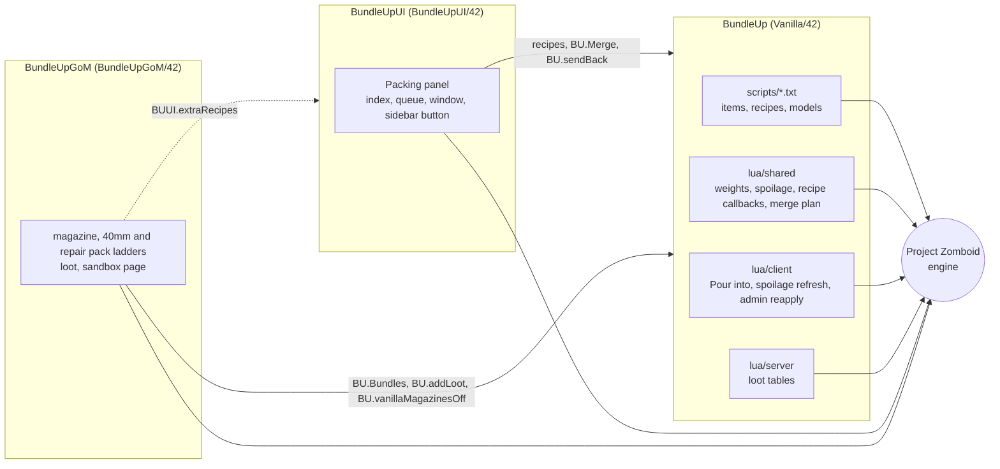
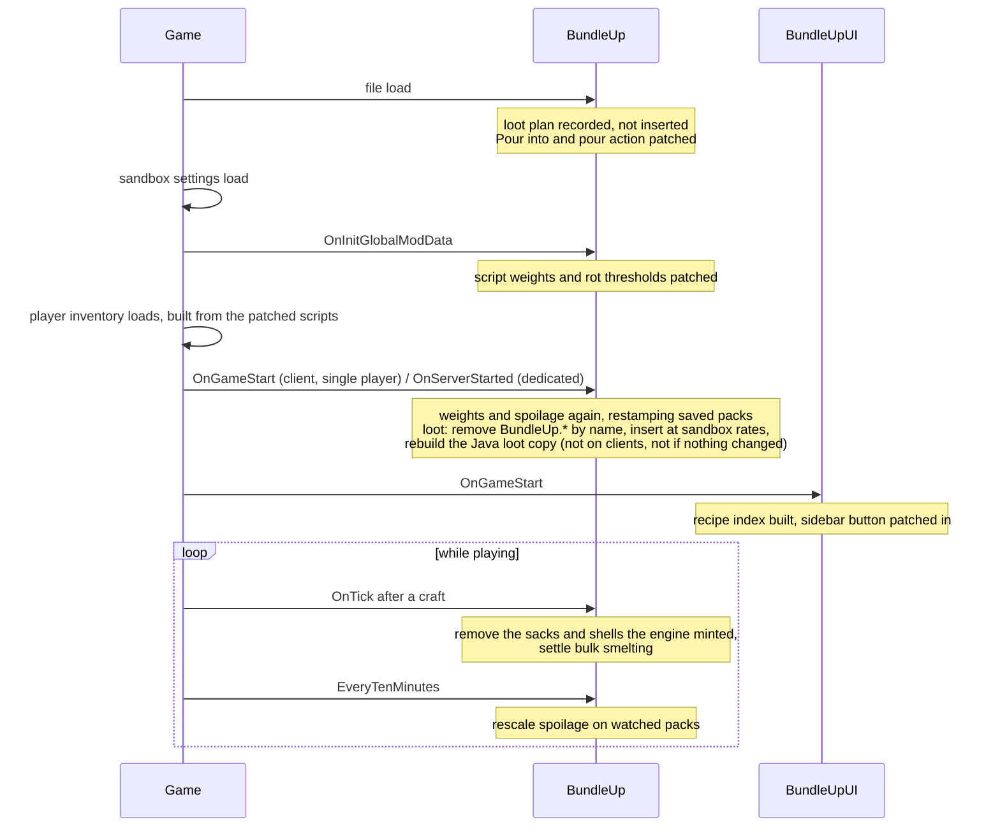
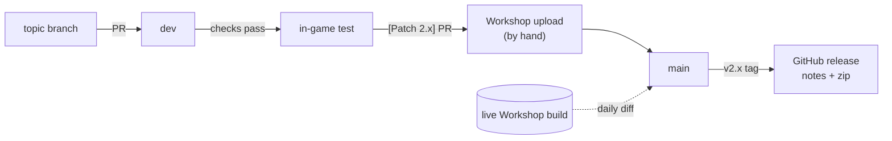

# How Bundle Up is put together

The [README](README.md) covers what the mod does and the engine surprises behind it. This is the map: which file does what, when each piece runs, the rules the code keeps, and how a change gets from a branch to the Workshop.

## Three mods, one subscription

| Folder | Mod id | What it is |
| --- | --- | --- |
| `Contents/mods/Vanilla/42/` | `BundleUp` | Everything that matters in play: items, recipes, weights, loot, spoilage, merging. No dependencies. |
| `Contents/mods/BundleUpUI/42/` | `BundleUpUI` | The optional Packing panel. Requires `BundleUp` and NeatUI Framework. |
| `Contents/mods/BundleUpGoM/42/` | `BundleUpGoM` | Optional Guns of Marz support: its magazines, 40mm rounds and weapon repair packs, up to crates. Requires `BundleUp` and Guns of Marz. |

The UI add-on reads the base mod (its recipes, `BU.Merge`, the transfer helpers). The base mod never calls the UI, so it plays the same with the add-on off.

The Guns of Marz add-on plugs into the base mod through three hooks: its pack rows go into `BU.Bundles`, its loot goes into the base mod's plan through `BU.addLoot`, and it sets `BU.vanillaMagazinesOff` so nobody can pack mags into a vanilla magazine box while GoM is swapping those for its own. If the panel is on too, it lists GoM's own ammo recipes in `BUUI.extraRecipes`. Its items and recipes are in module `BundleUp`, so the panel and the checks treat them like the base mod's.

Build 42 only reads a `common/` folder or a version folder like `42/`. Nothing at the mod root is loaded, so there isn't anything there.

## Data and behaviour

zedscript declares the items and recipes, and the flags the engine enforces on its own. Lua only covers what a flag can't.

| File | What's in it |
| --- | --- |
| `scripts/items/boxed.txt` | 326 packs: nail and screw boxes, food cartons, supply, medical and parts boxes, brake and suspension boxes |
| `scripts/items/bundled.txt` | 262 packs: wire, sheets, magazine and book boxes, six-packs, ingot stacks |
| `scripts/items/roped.txt` | 196 packs: rope bundles of planks, pipes, hides and building stock |
| `scripts/items/sacked.txt` | 87 packs: sacks, seed pouches, scrap, ore and charcoal |
| `scripts/items/tiered.txt` | 166 food Cases. Generated. |
| `scripts/recipes/*.txt` | 130 recipes: pack and unpack per family, plus ammo, thread, bulk smelting, and the generated Case recipes |
| `scripts/bu_models.txt` | 23 world models, so a dropped pack is a visible pile |
| `sandbox-options.txt` | 322 options on eight pages |
| `lua/shared/Translate/EN/*.json` | Item names, recipe labels, sandbox text |

Most files are written by hand. These come out of the generators in estral-tools, and CI fails if they drift:

- `items/tiered.txt`, `recipes/recipes_tiered.txt` and `BU_WeightData_Tiers.lua`, whole, from the pack ladders
- the sorted block at the end of `ItemName.json` and `Recipes.json`
- the block order and pages of `sandbox-options.txt` (labels and tooltips stay hand-written)
- every pack's `Weight =` line, so the script agrees with the Lua

## Module map

Base mod, `Contents/mods/Vanilla/42/media/lua/`:

| File | Side | Job |
| --- | --- | --- |
| `shared/BU_WeightData.lua` | shared | Hand-kept pack rows, which weight slider each base item follows, per-family weight cuts, and walking a nested pack down to its vanilla item |
| `shared/BU_WeightData_Packs.lua` | shared | The other ~580 pack rows and their categories. The generators read this. |
| `shared/BU_WeightData_Tiers.lua` | shared | Generated rows for the 166 food Cases |
| `shared/BU_ApplyWeights.lua` | shared | Sets each pack's weight to base weight × count minus the slider cut, and restamps packs already in a save |
| `shared/BU_ApplySpoilage.lua` | shared | Scales pack rot thresholds by the sandbox spoilage rate |
| `shared/BUpacking.lua` | shared | The `BUInv` recipe callbacks: soda and petrol fluids, removing minted empties, flavour tests, carrying food age across a pack |
| `shared/BU_BulkSmelt.lua` | shared | Bulk smelting: picks the exact melt set and settles it the tick after the engine consumes |
| `shared/BU_MergeData.lua` | shared | `BU.Merge`: what can merge, gathering it across containers, and the pour plan |
| `shared/BU_ConsolidateDrainable.lua` | shared | Patches vanilla's pour action for chained pours and server timing |
| `client/BU_MergeDrainables.lua` | client | "Pour into" that also sees worn bags and nearby crates |
| `client/BU_Transfer.lua` | client | Sends items back to the container they came from |
| `client/BU_Watched.lua` | client | Walks the player's inventory and any open loot containers |
| `client/BU_RefreshSpoilage.lua` | client | Every ten in-game minutes, rescales packs the player is looking at |
| `client/BU_ReapplyWeights.lua` | client | Admin menu option that re-runs the weight patch |
| `server/BUProceduralDistributions.lua` | server | The loot plan, inserted at the sandbox spawn rates |

UI add-on, `Contents/mods/BundleUpUI/42/media/lua/client/`:

| File | Job |
| --- | --- |
| `BUUI_Index.lua` | Indexes the packing recipes and turns what's in reach into pack, unpack and merge rows |
| `BUUI_Queue.lua` | Runs a batch one craft or pour at a time and sends outputs back where their inputs came from |
| `BUUI_Panel.lua` | The window: tabs, sources, list, footer buttons, auto-refresh |
| `BUUI_Row.lua` | One recycled list row |
| `BUUI_Spinner.lua` | The `-` / number / `+` / `MAX` control |
| `BUUI_Button.lua` | The NeatUI-skinned button |
| `BUUI_Sidebar.lua` | The sidebar fly-out that opens the panel |

Guns of Marz add-on, `Contents/mods/BundleUpGoM/42/media/`:

| File | Job |
| --- | --- |
| `scripts/items/gunsofmarz.txt` | 174 packs: a box, carton and crate for each of the 55 magazines, a carton and crate per 40mm round, and the repair pack ladder |
| `scripts/recipes/recipes_gunsofmarz.txt` | Pack and unpack for each tier |
| `sandbox-options.txt` | The Guns of Marz page: three spawn sliders and a weight cut, all in the `BundleUp` namespace |
| `lua/shared/BUGoM_Packs.lua` | Which magazine goes on which ladder, the `BU.Bundles` rows, and the vanilla magazine switch |
| `lua/client/BUGoM_UI.lua` | Lists GoM's own ammo recipes for the panel |
| `lua/server/BUGoM_Distributions.lua` | The add-on's loot, behind GoM's high-cap and explosives settings |

## When things run

Most of the bugs in this mod's history came from doing the right thing at the wrong moment, so the order is worth drawing.

The README has the long version of why weights need `OnInitGlobalModData` and loot needs `OnGameStart`.

## Rules the code keeps

**Packing never creates or destroys an item.** Engine flags come first: `IsExclusive` and `ItemCount` on every unpack input, `IsFull`, `IsEmpty` and `IsUndamaged` where they apply. They hold on a dedicated server and no Lua path can skip them. A Lua `onTest` is only for what has no flag (rot, soda flavour, loaded magazines). Whatever the engine hands out anyway, like the empty sack `ReplaceOnDeplete` mints, gets noted in `onCreate` and removed the next tick.

**Servers and clients get the same numbers.** Weight and spoilage live in `shared/`, and each pack's script `Weight` is kept equal to what the Lua works out, because a dedicated server reads the script.

**Loot is changed by name, never by index.** Every name the mod inserts starts with `BundleUp.`, so removing by name undoes the last pass exactly, even after another mod has rewritten the same arrays. Add-ons register through `BU.addLoot` at file load, so their packs go in the same pass.

**`main` is the Workshop build, byte for byte.** Project Zomboid won't let you join a server whose mod files differ, so what's on `main` is exactly what was uploaded, line endings included.

## From a change to the Workshop

Every PR runs two required jobs:

- **generated files are current:** the three generators with `--check`
- **mod files are valid:** translations, script references, Lua parsing, line endings

The scripts behind both live in estral-tools, a private repo CI checks out with a read-only deploy key.

Pushing a `v*` tag publishes the GitHub release with that version's patch notes and a zip of the build. A daily job downloads the live Workshop build with steamcmd and diffs it against `main`, so a drift shows up the next morning.

## Testing

There's no unit test suite. Most of the logic only means something inside the running game, so behaviour changes get tested in game, on a local dedicated server when it touches multiplayer.

What does run on every PR is the checks above, plus one behaviour check.

The `behaviour` workflow runs the base branch's Lua and the PR's Lua side by side in Python with [lupa](https://github.com/scoder/lupa). Game objects are stubbed, both versions get the same fixtures, and every result and engine call is compared.

- A `refactor:` PR fails on any difference.
- Any other PR gets the diff as a warning.
- New Lua that throws fails any PR.

The loot file gets the same comparison against vanilla's real tables, but only locally, because that needs a game install.
